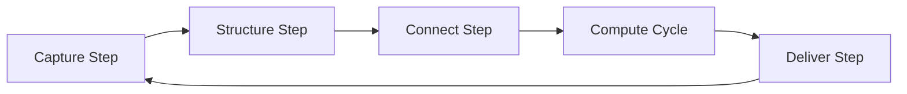

# EKA Implementation Roadmap

## EKA Maturity Framework: Three Evolution Stages

1. Diagramming: Conceptual stetching, relationship mapping, and initial structure sorting
2. Meta-Modeling & Ontology: Defining meta-models, standardizing entities and properties, and creating formal semantic definitions.
3. Executable Knowledge Graph: Building enterprise-wide linked data, automated reasoning, and scalable intelligent services.

## EKA Maturity Core Artifacts

1. Diagram: Drafting of concept maps and initial connections
2. Meta-Model: Structured template defining categories and properties
3. Ontology: Detailed semantic definition of enterprise concepts
4. Knowledge Graph: Connected network of facts, systems, and processes
5. Decision Model: Executable rule logic and policy definitions
6. Knowledge Product: Packaged knowledge assets, including datasets and smart services

## EKA Implementation Cycle (as a workflow of the artifacts)

Here are the details of every step:

1. Capture Step: Conceptual sketching, relationship mapping, connections
2. Structure Step: Structural template defining categories and properties
3. Connect Step: Detailed semantic definition of concepts
4. Compute Cycle: Executable rule logic and policy definitions
5. Deliver Step: Packaged knowledge and smart services

## Inputs and Outputs of EKA

### Knowledge Inputs to EKA Framework

- Structured Data
- Unstructured Documents
- Processes and Systems Information
- Experience and Insights
- External Knowledge

### Outputs (Outcomes) from EKA Framework

- Faster Insight
- Better Decision
- Executable Knowledge
- Cost & Efficiency
- Continuous Evolution

## EKA Core Principles

1. Executable First
2. Semantic Driven
3. Computable
4. Reusable
5. Evolvable
6. Value Creater