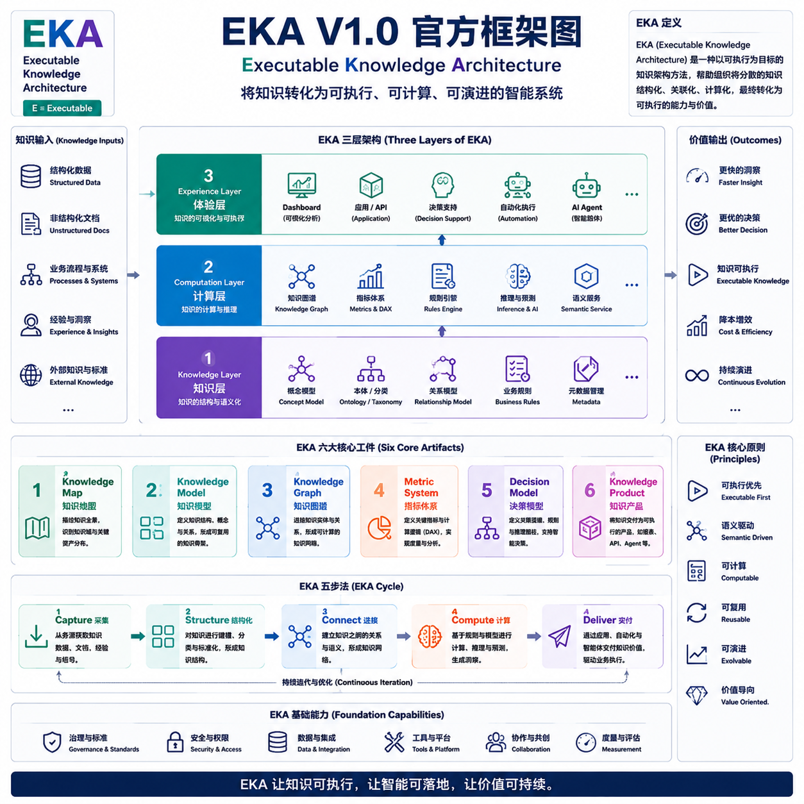

# EKA V1.0 参考模型框架

- [EKA V1.0 参考模型框架](#eka-v10-参考模型框架)
  - [一、EKA V1.0的核心定义](#一eka-v10的核心定义)
  - [二、EKA的三大支柱](#二eka的三大支柱)
  - [三、EKA的核心工件（Artifacts）](#三eka的核心工件artifacts)
  - [四、EKA方法论流程（EKA Cycle）- 五步法](#四eka方法论流程eka-cycle--五步法)
  - [EKA 1.0 框架图](#eka-10-框架图)

## 一、EKA V1.0的核心定义

> EKA (Executable Knowledge Architecture) - 可执行知识架构 - 是一种以可执行为目标核心的知识架构方法，用于帮助组织将分数的知识结构化、关联化、计算化，最终转化为可执行的能力与价值。

对比传统企业架构(EA)：

| 传统EA | EKA |
| --- | --- |
| 架构蓝图 | 知识系统 |
| 文档驱动 | 知识驱动 |
| 静态模型 | 可计算模型 |
| 一次性交付 | 持续演讲 |

## 二、EKA的三大支柱

在我们熟悉的传统EA中，我们经常看到的是四层架构：
1. 业务层 (Business Layer)
2. 应用层 (Application Layer)
3. 信息/数据层 (Information/Data Layer)
4. 技术层 (Technology Layer)

EKA使用三层结构来重新定义企业内部的架构体系：

EKA第一层：知识层 Knowledge Layer （本层也是EKA的核心）
- 概念（Concept）
- 关系（Relation）
- 规则（Rule）
- 语义（Semantic）

EKA第二层：计算层 Computating Layer
- 知识图谱（Knowledge Graph）
- 指标模型（DAX / Metrics）
- 推理规则（Inference）
- AI / LLM 接口

EKA第三层：体验层 Experience Layer
- Dashboard (Power BI)
- API / 应用
- 决策界面
- 自动化流程

用一句话来说：

> EKA = Knowledge x Computation x Experience

## 三、EKA的核心工件（Artifacts）

作为一个可执行的参考框架，可见和可衡量的交付物（工件）是必不可少的。EKA定义了如下六大核心工件：

1. 知识地图（Knowledge Map）：企业知识全景
2. 知识模型（Knowledge Model）：企业元模型（Meta-Model）
3. 知识图谱（Knowledge Graph）：Graph Database
4. 指标体系（Metric System）：DAX / KPI / 计算逻辑
5. 决策模型（Decision Model）：决策规则 + 推理路径
6. 知识产品（Knowledge Product）：Dashboard / API / AI Agent

## 四、EKA方法论流程（EKA Cycle）- 五步法

1. 采集（Capture）：文档 / 数据 / 人的经验
2. 结构化（Structure）：建模（Meta-Modeling），分类（Taxonomy）
3. 连接（Connect）：建立关系（Graph），建立语义（Semantic）
4. 计算（Compute）：指标计算（DAX），推理（规则 / AI）
5. 交付（Deliver）：仪表盘（Dashboard），API，Agent

## EKA 1.0 框架图

